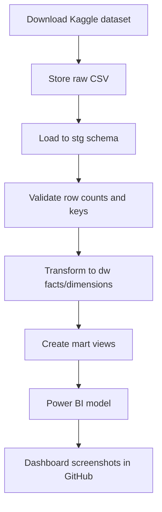

# Project Plan: E-commerce Analytics ELT Pipeline

## Portfolio Title

**E-commerce Analytics ELT Pipeline with SQL Server, Azure SQL and Power BI**

## Problem Statement

ทีม analyst ต้องการ dashboard ที่ตอบคำถามยอดขาย การส่งสินค้า คุณภาพข้อมูล และ performance ของ seller จาก raw order data หลายตาราง เป้าหมายของ Data Engineer คือสร้าง pipeline ที่โหลดข้อมูลได้ซ้ำได้ ทำความสะอาดข้อมูล สร้าง warehouse schema และส่งต่อ mart ที่ใช้ทำ BI ได้ง่าย

## Scope

### In Scope

- โหลด CSV จาก Olist dataset เข้า staging
- สร้าง SQL Server/Azure SQL schema
- Clean และ transform เป็น dimensional model
- สร้าง quality checks และ reconciliation queries
- สร้าง marts/views สำหรับ Power BI
- ทำ dashboard plan และ screenshot เมื่อทำ PBIX เสร็จ

### Out of Scope

- Real-time streaming
- ML recommendation model
- Production-grade orchestration ที่มี cost สูง
- Upload raw data ขนาดใหญ่ลง GitHub

## Data Flow

## Database Design

### Staging

- `stg.orders`
- `stg.order_items`
- `stg.order_payments`
- `stg.order_reviews`
- `stg.customers`
- `stg.products`
- `stg.sellers`
- `stg.geolocation`
- `stg.product_category_translation`

### Warehouse

- `dw.dim_date`
- `dw.dim_customer`
- `dw.dim_product`
- `dw.dim_seller`
- `dw.dim_geography`
- `dw.fact_orders`
- `dw.fact_order_items`
- `dw.fact_payments`
- `dw.fact_reviews`

### Mart

- `mart.monthly_sales`
- `mart.delivery_performance`
- `mart.product_category_performance`
- `mart.seller_scorecard`
- `mart.data_quality_summary`

## Key Metrics

| Metric | Definition |
|---|---|
| Total Revenue | Sum of order item price + freight, depending on dashboard context |
| Orders | Count distinct order_id |
| Average Order Value | Revenue / Orders |
| Delivery Delay Days | Actual delivered date - estimated delivery date |
| On-time Delivery Rate | Delivered orders where actual date <= estimated date / delivered orders |
| Cancellation Rate | Cancelled orders / total orders |
| Average Review Score | Average review_score |

## Power BI Pages

### 1. Executive Overview

- KPI cards: revenue, orders, AOV, on-time rate, review score
- Monthly revenue trend
- Order status breakdown
- Top 10 states by revenue

### 2. Sales and Products

- Revenue by category
- AOV by category
- Category trend by month
- Product count and order item count

### 3. Logistics

- Delivery delay trend
- Delay by state/city
- Estimated vs actual delivery distribution
- Orders at risk by seller/state

### 4. Seller and Customer

- Seller scorecard
- Customer geography
- Review score distribution
- Repeat customer proxy if available

### 5. Data Quality

- Null critical fields
- Duplicate primary keys
- Orphan order items/payments/reviews
- Invalid date sequence

## GitHub Deliverables

- `README.md`: overview, architecture, screenshots, how to run
- `ROADMAP.md`: learning and build roadmap
- `DATASET_RESEARCH.md`: dataset shortlist and final recommendation
- `PROJECT_PLAN.md`: end-to-end technical plan
- `sql/`: DDL, transformations, quality checks
- `dashboards/`: Power BI screenshots and report notes
- `docs/architecture.md`: architecture and design decisions

## Milestones

| Milestone | Done When |
|---|---|
| M1 Dataset selected | Dataset source, business questions and scope documented |
| M2 SQL staging | CSV files can be loaded into `stg` tables |
| M3 Warehouse | Facts/dimensions created and row counts reconciled |
| M4 Mart | Views support all dashboard pages |
| M5 Dashboard | Power BI/Looker dashboard screenshots committed |
| M6 Portfolio ready | README explains result, limitations and next steps |

