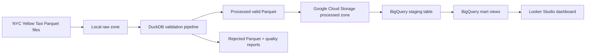

# NYC Taxi GCP Data Pipeline

Portfolio project สำหรับสร้าง data pipeline จาก NYC Yellow Taxi monthly Parquet files ไปสู่ Google Cloud Storage, BigQuery analytics marts และ Looker Studio dashboard

## Project Goal

โปรเจกต์นี้ออกแบบเพื่อโชว์ทักษะ Data Engineering for Analyst:

- อ่านและตรวจคุณภาพไฟล์ Parquet ขนาดใหญ่ด้วย DuckDB
- แยกข้อมูลเป็น raw, processed และ rejected zones
- ออกแบบ cloud data lake บน Google Cloud Storage
- โหลดข้อมูลเข้า BigQuery staging table
- สร้าง analytics marts สำหรับ dashboard
- ออกแบบ Looker Studio dashboard แบบ professional
- เก็บ code, SQL, docs และ test ไว้ใน GitHub portfolio

## Current Dataset

Raw data อยู่ที่:

```text
C:\data-engineering-portfolio\Project_nyc-taxi-gcp-data-pipeline\nyc-taxi-gcp-data-pipeline\data\raw
```

ไฟล์ที่มีตอนนี้:

```text
yellow_tripdata_2026-01.parquet
yellow_tripdata_2026-02.parquet
yellow_tripdata_2026-03.parquet
```

Source grain:

```text
1 row = 1 NYC Yellow Taxi trip
```

## Architecture



## Project Structure

```text
nyc-taxi-gcp-data-pipeline/
├── data/
│   ├── raw/
│   ├── processed/
│   └── rejected/
├── docs/
│   ├── DASHBOARD_DESIGN.md
│   ├── DATA_MODEL.md
│   ├── GCP_BIGQUERY_SETUP.md
│   ├── PROJECT_ROADMAP.md
│   ├── STEP_BY_STEP_GUIDE.md
│   └── data_dictionary.md
├── logs/
├── reports/
├── sql/
│   └── bigquery/
├── src/
├── tests/
├── .env.example
├── .gitignore
├── requirements.txt
└── README.md
```

## Quick Start

### 1. Go to project folder

```powershell
cd C:\data-engineering-portfolio\Project_nyc-taxi-gcp-data-pipeline\nyc-taxi-gcp-data-pipeline
```

### 2. Create environment

```powershell
python -m venv .venv
.\.venv\Scripts\Activate.ps1
python -m pip install --upgrade pip
pip install -r requirements.txt
```

### 3. Inspect source files

```powershell
python -m src.inspect_data
```

### 4. Run local validation pipeline

```powershell
python -m src.main
```

Expected outputs:

```text
data/processed/year=2026/month=01/yellow_tripdata_2026-01_valid.parquet
data/rejected/year=2026/month=01/yellow_tripdata_2026-01_rejected.parquet
reports/yellow_tripdata_2026-01_quality.csv
logs/pipeline.log
```

### 5. Run tests

```powershell
python -m pytest -q
```

If `pytest` is not recognized, use the virtual environment Python directly:

```powershell
.\.venv\Scripts\python.exe -m pytest -q
```

## Data Quality Rules

A valid trip must satisfy:

- pickup and dropoff timestamps are present
- dropoff time is later than pickup time
- trip duration is no more than `MAX_TRIP_HOURS`
- trip distance is zero or greater
- total amount is zero or greater
- pickup and dropoff location IDs are positive
- pickup timestamp belongs to the source file month

Invalid rows are preserved in `data/rejected` with a `rejection_reason`.

## BigQuery Marts

SQL files:

```text
sql/bigquery/01_create_core_views.sql
sql/bigquery/02_create_dashboard_marts.sql
sql/bigquery/03_data_quality_checks.sql
```

Recommended marts:

- `nyc_taxi_mart.vw_trip_enriched`
- `nyc_taxi_mart.mart_daily_kpis`
- `nyc_taxi_mart.mart_hourly_demand`
- `nyc_taxi_mart.mart_payment_mix`
- `nyc_taxi_mart.mart_zone_pair_performance`
- `nyc_taxi_mart.mart_trip_outliers`
- `nyc_taxi_mart.mart_data_quality_summary`

## Dashboard Pages

Looker Studio dashboard design:

- Executive Overview
- Demand Patterns
- Revenue and Fare
- Operations Quality
- Data Quality

ดูรายละเอียดใน `docs/DASHBOARD_DESIGN.md`

## Learning Path

ถ้าคุณกำลังทำตามทีละขั้น ให้เริ่มจาก:

1. `docs/STEP_BY_STEP_GUIDE.md`
2. `docs/DATA_MODEL.md`
3. `docs/GCP_BIGQUERY_SETUP.md`
4. `docs/DASHBOARD_DESIGN.md`
5. `docs/PROJECT_ROADMAP.md`

## GitHub Notes

Do commit:

- source code
- SQL
- docs
- tests
- sample configs

Do not commit:

- raw Parquet files
- processed/rejected data
- `.env`
- credentials
- logs and generated reports
