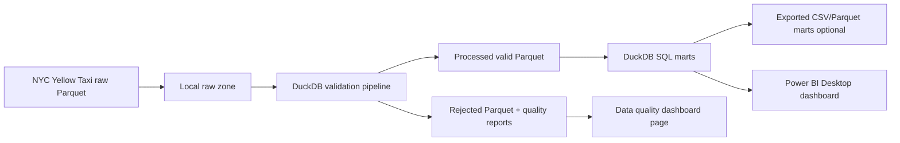

# NYC Taxi Local Analytics Pipeline

Portfolio project สำหรับสร้าง data pipeline แบบไม่ใช้ Cloud จาก NYC Yellow Taxi monthly Parquet files ไปสู่ local validated data lake, DuckDB SQL marts และ Power BI Desktop dashboard

## Why No Cloud

โปรเจกต์นี้ตั้งใจทำแบบ local-first เพราะไม่ต้องใช้บัตรเครดิตหรือ cloud billing แต่ยังโชว์ทักษะ Data Engineering ที่สำคัญได้ครบ:

- ingest และ validate Parquet files ขนาดหลายล้านแถว
- แยก raw, processed และ rejected zones
- ทำ data quality checks พร้อม rejected reason
- สร้าง SQL marts ด้วย DuckDB
- ออกแบบ dashboard สำหรับ analyst ด้วย Power BI Desktop
- เขียน docs, tests และ Git workflow แบบ portfolio-ready

## Current Dataset

Raw data อยู่ที่:

```text
C:\data-engineering-portfolio\Project_nyc-taxi-gcp-data-pipeline\nyc-taxi-gcp-data-pipeline\data\raw
```

ไฟล์ที่มีตอนนี้:

```text
yellow_tripdata_2026-01.parquet
yellow_tripdata_2026-02.parquet
yellow_tripdata_2026-03.parquet
```

Source grain:

```text
1 row = 1 NYC Yellow Taxi trip
```

## Architecture



## Project Structure

```text
nyc-taxi-gcp-data-pipeline/
├── data/
│   ├── raw/
│   ├── processed/
│   └── rejected/
├── docs/
│   ├── DASHBOARD_DESIGN.md
│   ├── DATA_MODEL.md
│   ├── LOCAL_ANALYTICS_SETUP.md
│   ├── PROJECT_ROADMAP.md
│   ├── STEP_BY_STEP_GUIDE.md
│   └── data_dictionary.md
├── logs/
├── reports/
├── sql/
│   └── duckdb/
├── src/
├── tests/
├── .env.example
├── .gitignore
├── requirements.txt
└── README.md
```

## Quick Start

### 1. Go to project folder

```powershell
cd C:\data-engineering-portfolio\Project_nyc-taxi-gcp-data-pipeline\nyc-taxi-gcp-data-pipeline
```

### 2. Use the virtual environment

```powershell
.\.venv\Scripts\Activate.ps1
```

If you need to recreate it:

```powershell
python -m venv .venv
.\.venv\Scripts\Activate.ps1
python -m pip install --upgrade pip
pip install -r requirements.txt
```

### 3. Inspect source files

```powershell
.\.venv\Scripts\python.exe -m src.inspect_data
```

### 4. Run local validation pipeline

```powershell
.\.venv\Scripts\python.exe -m src.main
```

Expected outputs:

```text
data/processed/year=2026/month=01/yellow_tripdata_2026-01_valid.parquet
data/rejected/year=2026/month=01/yellow_tripdata_2026-01_rejected.parquet
reports/yellow_tripdata_2026-01_quality.csv
logs/pipeline.log
```

### 5. Run tests

```powershell
.\.venv\Scripts\python.exe -m pytest -q
```

### 6. Export dashboard marts for Power BI

```powershell
.\.venv\Scripts\python.exe -m src.export_marts
```

Expected outputs:

```text
exports/mart_daily_kpis.csv
exports/mart_hourly_demand.csv
exports/mart_payment_mix.csv
exports/mart_zone_pair_performance.csv
exports/mart_data_quality_summary.csv
```

## Data Quality Rules

A valid trip must satisfy:

- pickup and dropoff timestamps are present
- dropoff time is later than pickup time
- trip duration is no more than `MAX_TRIP_HOURS`
- trip distance is zero or greater
- total amount is zero or greater
- pickup and dropoff location IDs are positive
- pickup timestamp belongs to the source file month

Invalid rows are preserved in `data/rejected` with a `rejection_reason`.

## Local SQL Marts

SQL files:

```text
sql/duckdb/01_create_core_views.sql
sql/duckdb/02_create_dashboard_marts.sql
sql/duckdb/03_data_quality_checks.sql
```

Recommended marts:

- `vw_trip_enriched`
- `mart_daily_kpis`
- `mart_hourly_demand`
- `mart_payment_mix`
- `mart_zone_pair_performance`
- `mart_trip_outliers`
- `mart_data_quality_summary`

## Dashboard Tool

Recommended tool: **Power BI Desktop**

Use Power BI Desktop to connect to exported mart CSV/Parquet files or to the processed Parquet folder. The dashboard should include:

- Executive Overview
- Demand Patterns
- Revenue and Fare
- Operations Quality
- Data Quality

ดูรายละเอียดใน `docs/DASHBOARD_DESIGN.md`

## Learning Path

ถ้าคุณกำลังทำตามทีละขั้น ให้เริ่มจาก:

1. `docs/STEP_BY_STEP_GUIDE.md`
2. `docs/DATA_MODEL.md`
3. `docs/LOCAL_ANALYTICS_SETUP.md`
4. `docs/DASHBOARD_DESIGN.md`
5. `docs/PROJECT_ROADMAP.md`

## GitHub Notes

Do commit:

- source code
- SQL
- docs
- tests
- sample configs

Do not commit:

- raw Parquet files
- processed/rejected data
- `.env`
- credentials
- logs and generated reports
- exported marts and local `.duckdb` database files
