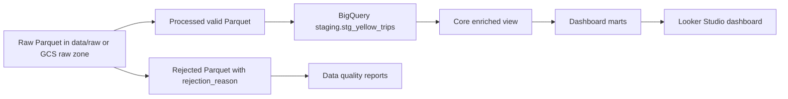

# Data Model Design

## Business Grain

Source grain:

```text
1 row = 1 completed or attempted yellow taxi trip
```

Analytics grain ที่แนะนำ:

- Trip-level fact สำหรับ detail analysis
- Daily/hourly mart สำหรับ dashboard performance
- Zone pair mart สำหรับ pickup/dropoff movement
- Data quality mart สำหรับความน่าเชื่อถือของ pipeline

## Layered Design



## Recommended BigQuery Layers

| Layer | Dataset | Purpose |
|---|---|---|
| Raw | `nyc_taxi_raw` | Immutable source files or external table |
| Staging | `nyc_taxi_staging` | Loaded processed Parquet with light standardization |
| Mart | `nyc_taxi_mart` | Business-friendly views for dashboard |

## Staging Table

Suggested table:

```text
nyc_taxi_staging.stg_yellow_trips
```

Partition:

```text
pickup_date
```

Cluster:

```text
PULocationID, DOLocationID, payment_type
```

เหตุผล:

- `pickup_date` ช่วยลด cost เวลาดู dashboard เป็นช่วงเวลา
- location/payment columns ถูกใช้ filter และ group by บ่อย
- staging table ยังเก็บ trip-level detail ไว้ตรวจสอบย้อนหลังได้

## Core View

Suggested view:

```text
nyc_taxi_mart.vw_trip_enriched
```

View นี้ควรมี fields:

- trip identifiers and timestamps
- pickup/dropoff date, month, hour, day of week
- trip duration
- fare metrics
- payment labels
- airport/congestion indicators
- data source metadata

## Dashboard Marts

| Mart | Grain | Dashboard Use |
|---|---|---|
| `mart_daily_kpis` | 1 row per pickup date | KPI trend |
| `mart_hourly_demand` | 1 row per pickup hour | Peak-hour analysis |
| `mart_payment_mix` | 1 row per month/payment type | Payment behavior |
| `mart_zone_pair_performance` | 1 row per pickup/dropoff zone pair | Route and zone analysis |
| `mart_data_quality_summary` | 1 row per quality check | Trust and monitoring |

## Professional Modeling Rules

- แยก raw, staging, mart ให้ชัด เพื่อให้ lineage อธิบายง่าย
- เก็บ rejected data พร้อมเหตุผล ไม่ทิ้งเงียบ ๆ
- ใช้ partition/cluster ตาม query pattern ไม่ใช่ตามความสวยงาม
- ตั้งชื่อ mart ให้ analyst เข้าใจทันที
- ทำ SQL views ให้ dashboard ไม่ต้องคำนวณซ้ำเยอะ
- แยก metric definition ไว้ในเอกสาร เพื่อให้ dashboard ไม่ตีความคนละแบบ

## Metric Definitions

| Metric | Definition |
|---|---|
| Trips | Count of rows in valid trip table |
| Gross Revenue | Sum of `total_amount` |
| Fare Revenue | Sum of `fare_amount` |
| Average Fare | `SUM(total_amount) / COUNT(*)` |
| Average Trip Distance | `AVG(trip_distance)` |
| Average Duration Minutes | `AVG(trip_duration_minutes)` |
| Tip Rate | `SUM(tip_amount) / NULLIF(SUM(fare_amount), 0)` |
| Airport Trip Rate | Trips with `Airport_fee > 0` / total trips |
| Data Rejection Rate | Rejected rows / total source rows |

