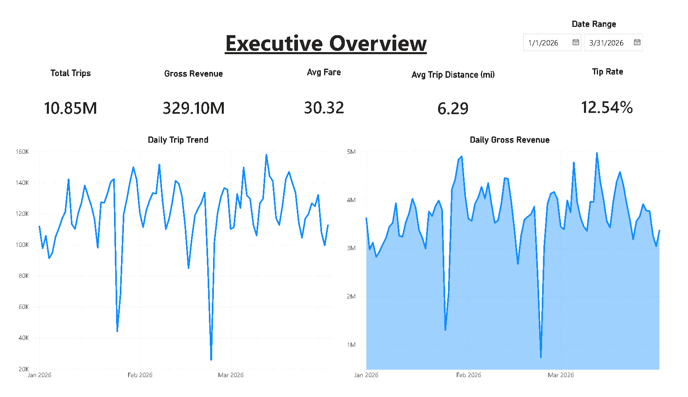

# Data Engineering Portfolio

Portfolio hub for data engineering and analytics projects. The goal is to show practical skills across data ingestion, cloud databases, data quality, SQL modeling, analytics marts, and business dashboard design.

## Featured Projects

| Project | Focus | Stack | Status |
|---|---|---|---|
| [Azure MTA Ridership + Weather Incremental Pipeline](azure-mta-ridership-weather-pipeline/) | Azure cloud pipeline with API ingestion, Azure SQL warehouse, audit logging, data quality checks, and Power BI dashboard | Python, Azure SQL Database, T-SQL, Power BI, Open-Meteo API, MTA Open Data | Portfolio-ready v1 |
| [NYC Taxi Local Analytics Pipeline](Project_nyc-taxi-gcp-data-pipeline/nyc-taxi-gcp-data-pipeline/) | Local data pipeline, DuckDB marts, data quality, Power BI dashboard | Python, DuckDB, SQL, Power BI | Portfolio-ready v1 |
| [Olist E-Commerce Data Pipeline](https://github.com/kriangsak0066/olist-data-pipeline) | E-commerce ETL, SQL Server warehouse, Power BI analytics | Python, SQL Server, Power BI | Separate project repo |
| [Air Quality & Weather Analytics Pipeline](https://github.com/kriangsak0066/air-quality-weather-data-pipeline) | PM2.5 and weather analytics pipeline with OpenAQ and Open-Meteo API ingestion, DuckDB warehouse, SQL data quality checks, and dashboard-ready marts | Python, DuckDB, SQL, OpenAQ API, Open-Meteo API, Power BI | Separate project repo |

## Highlight: Azure MTA Ridership + Weather Incremental Pipeline

This project ingests NYC subway hourly ridership data from MTA Open Data, enriches it with historical weather data from Open-Meteo, loads the data into Azure SQL Database, builds staging and warehouse tables, creates analytics mart views, and presents the results in a Power BI dashboard.

Key outcomes:

- 526,832 subway ridership records loaded for the initial 7-day window
- 168 hourly weather records loaded and joined to ridership marts
- 424 station complexes modeled in the station dimension
- 14 successful audit log records across two data sources
- Data quality checks passed for null keys, duplicates, negative values, weather duplicates, relationships, and audit status
- Power BI dashboard includes ridership overview, station analysis, weather impact, and pipeline health pages

Dashboard preview:

More dashboard pages:

- [Station Analysis](azure-mta-ridership-weather-pipeline/dashboards/images/02-station-analysis.jpg)
- [Weather Impact](azure-mta-ridership-weather-pipeline/dashboards/images/03-weather-impact.jpg)
- [Pipeline Health](azure-mta-ridership-weather-pipeline/dashboards/images/04-pipeline-health.jpg)

Open the project:

[Azure MTA project README](azure-mta-ridership-weather-pipeline/README.md)

## Highlight: NYC Taxi Local Analytics Pipeline

This project processes NYC Yellow Taxi Parquet files locally, validates trip records, separates valid and rejected data, builds DuckDB SQL marts, and presents the results in a Power BI dashboard.

Key outcomes:

- 11.08M raw taxi trips processed
- 10.85M valid rows and 223.51K rejected rows tracked with quality evidence
- Analyst-ready marts for daily KPIs, demand patterns, payment mix, route performance, and data quality
- Power BI dashboard screenshots included for GitHub review

Dashboard preview:

More dashboard pages:

- [Demand Patterns](Project_nyc-taxi-gcp-data-pipeline/nyc-taxi-gcp-data-pipeline/docs/images/dashboard-02-demand-patterns.png)
- [Revenue and Fare](Project_nyc-taxi-gcp-data-pipeline/nyc-taxi-gcp-data-pipeline/docs/images/dashboard-03-revenue-and-fare.png)
- [Zone / Route Performance](Project_nyc-taxi-gcp-data-pipeline/nyc-taxi-gcp-data-pipeline/docs/images/dashboard-04-zone-route-performance.png)
- [Data Quality](Project_nyc-taxi-gcp-data-pipeline/nyc-taxi-gcp-data-pipeline/docs/images/dashboard-05-data-quality.png)

## Skills Demonstrated

- API data ingestion
- Cloud database setup with Azure SQL Database
- Cloud cost control and free-tier usage
- Incremental loading pattern
- Raw data partitioning by load date
- Audit logging and pipeline health monitoring
- Data validation and data quality reporting
- T-SQL staging, warehouse, and mart modeling
- DuckDB local analytics modeling
- Power BI dashboard design
- GitHub documentation for portfolio review

## Repository Map

- `azure-mta-ridership-weather-pipeline/`
  - Azure SQL data engineering project with MTA ridership and weather data
  - Includes Python extraction scripts, SQL warehouse scripts, Power BI dashboard, and documentation

- `Project_nyc-taxi-gcp-data-pipeline/nyc-taxi-gcp-data-pipeline/`
  - Local NYC Taxi analytics pipeline
  - Includes DuckDB marts, quality checks, Power BI dashboard, and documentation

- `docs/`
  - Portfolio-level documentation

- `dashboards/`
  - Shared dashboard references or older dashboard assets

- `sql/`
  - Shared or earlier SQL portfolio scripts

- `scripts/`
  - Shared or earlier utility scripts

## What Reviewers Should Open First

1. [Azure MTA project README](azure-mta-ridership-weather-pipeline/README.md)
2. [Azure MTA dashboard README](azure-mta-ridership-weather-pipeline/dashboards/README.md)
3. [NYC Taxi project README](Project_nyc-taxi-gcp-data-pipeline/nyc-taxi-gcp-data-pipeline/README.md)
4. [NYC Taxi dashboard design documentation](Project_nyc-taxi-gcp-data-pipeline/nyc-taxi-gcp-data-pipeline/docs/DASHBOARD_DESIGN.md)

## Notes

Large raw datasets, processed files, local databases, logs, and credentials are intentionally excluded from Git.
