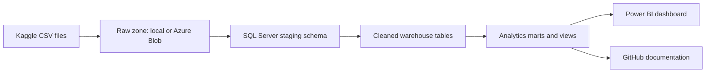

# Data Engineering Portfolio for Analyst

Repo นี้คือแผนและโครงงาน portfolio สำหรับฝึกบทบาท Data Engineer ที่ทำงานใกล้กับ Analyst โดยเน้น pipeline จาก dataset สาธารณะไปสู่ SQL warehouse และ dashboard ที่อัปโหลดลง GitHub ได้เป็นชิ้นงานสมบูรณ์

## เป้าหมาย

- ออกแบบ roadmap การฝึก Data Engineering แบบลงมือทำ
- เลือก dataset ที่เหมาะกับงาน analytics และเล่า business story ได้
- ใช้ cloud, Microsoft SQL Server/Azure SQL Database และ Power BI หรือ Google Looker Studio
- สร้าง repo ที่อ่านง่าย มี architecture, SQL, data model, quality checks และ dashboard plan

## Project หลักที่แนะนำ

**E-commerce Analytics ELT Pipeline**

ใช้ dataset: [Brazilian E-Commerce Public Dataset by Olist](https://www.kaggle.com/datasets/olistbr/brazilian-ecommerce)

เหตุผลที่เลือก:

- โครงสร้างเป็นหลายตาราง เหมาะกับการฝึก relational model, joins, data warehouse และ star schema
- มีมุมธุรกิจชัด เช่น sales, order lifecycle, delivery delay, payment behavior, customer geography และ seller performance
- เหมาะกับ dashboard สำหรับ analyst และ stakeholder

## Tech Stack

| Layer | Tool ที่แนะนำ | เหตุผล |
|---|---|---|
| Source | Kaggle CSV | dataset เข้าถึงง่ายและมีหลายตาราง |
| Storage | Azure Blob Storage หรือ local `data/raw` | แยก raw data ออกจาก SQL |
| Database | SQL Server Developer / Azure SQL Database | ฝึก T-SQL, schema design, indexing, views |
| Transform | T-SQL + Python optional | สร้าง staging, clean, mart |
| BI | Power BI Desktop | ทำ semantic model และ dashboard |
| Version Control | GitHub | แสดงเอกสาร, SQL, ERD, pipeline, screenshot |

## Architecture



## Repo Structure

```text
.
├── README.md
├── ROADMAP.md
├── DATASET_RESEARCH.md
├── PROJECT_PLAN.md
├── docs/
│   └── architecture.md
├── requirements.txt
├── sql/
│   ├── 01_create_schema.sql
│   ├── 02_quality_checks.sql
│   └── 03_create_marts.sql
├── scripts/
│   ├── README.md
│   └── load_olist_to_sql.py
├── data/
│   └── .gitkeep
└── dashboards/
    └── README.md
```

## Dashboard Pages

- Executive Overview: revenue, orders, AOV, delivery SLA, customer count
- Sales & Product: top categories, monthly trend, basket value
- Logistics: delivery delay, estimated vs actual delivery, state-level delay map
- Customer & Seller: repeat behavior, seller performance, geographic coverage
- Data Quality: nulls, duplicate keys, invalid dates, orphan records

## Success Criteria

- SQL Server/Azure SQL มี staging และ mart schema พร้อม quality checks
- มี data model ที่แยก fact/dimension ชัดเจน
- Dashboard มีอย่างน้อย 4 หน้า พร้อม insight เชิงธุรกิจ
- README อธิบาย problem, architecture, how to run, dashboard screenshots และ limitations
- Repo ไม่มี raw data ขนาดใหญ่หรือ credentials

## Quick Start

1. ดาวน์โหลด Olist dataset จาก Kaggle แล้วแตกไฟล์ไว้ที่ `data/raw/olist`
2. สร้าง database ใน SQL Server หรือ Azure SQL Database
3. ตั้งค่า `.env` จากตัวอย่าง `.env.example`
4. ติดตั้ง dependency ด้วย `pip install -r requirements.txt`
5. รัน `sql/01_create_schema.sql`
6. โหลดข้อมูลด้วย `python scripts/load_olist_to_sql.py`
7. รัน `sql/03_create_marts.sql` และ `sql/02_quality_checks.sql`
8. ต่อ Power BI เข้ากับ SQL Server/Azure SQL แล้วสร้าง dashboard ตาม [PROJECT_PLAN.md](PROJECT_PLAN.md)

## Dataset Alternatives

ดูรายละเอียดใน [DATASET_RESEARCH.md](DATASET_RESEARCH.md)
