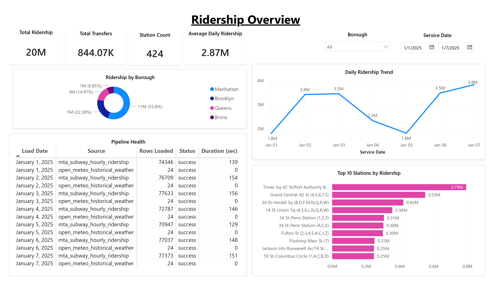
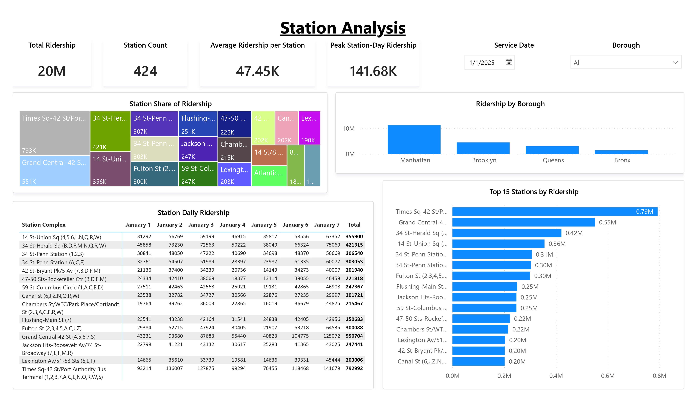
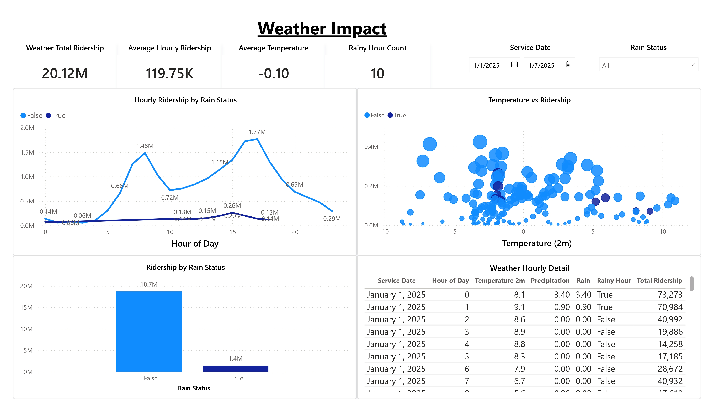
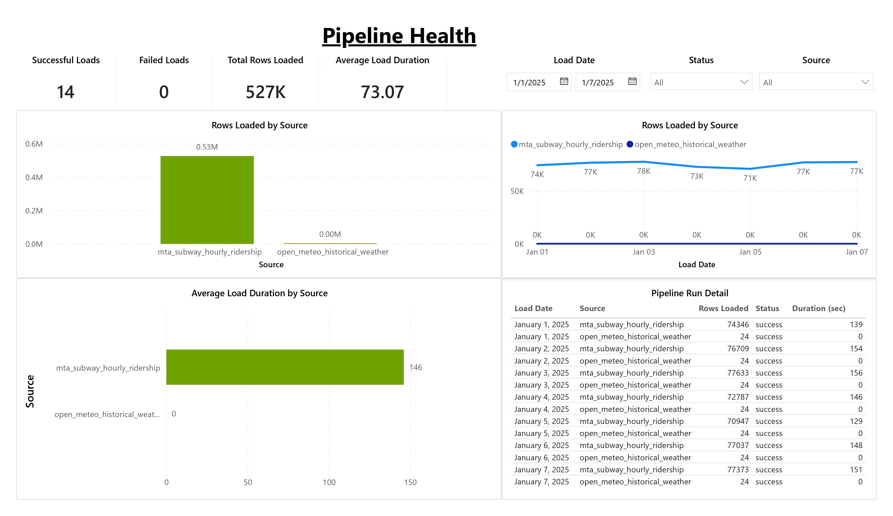

# Power BI Dashboard

## Overview

This folder contains the Power BI dashboard for the Azure MTA Ridership + Weather Incremental Pipeline project.

The dashboard connects to Azure SQL Database mart views and helps analysts explore subway ridership patterns, station performance, weather impact, and pipeline health.

## Dashboard File

Power BI report file:

```text
mta-ridership-weather-dashboard.pbix
```

## Data Source

The report uses Azure SQL Database as the analytical source.

Database:

```text
sqldb-mta-weather-dev-lex
```

Mart views used:

| View | Purpose |
|---|---|
| `mart.daily_station_ridership` | Ridership overview, station ranking, borough summary |
| `mart.hourly_ridership_pattern` | Hourly ridership pattern by station and date |
| `mart.weather_ridership_impact` | Weather-enriched hourly ridership analysis |
| `mart.pipeline_health_summary` | Pipeline audit and load monitoring |

## Dashboard Pages

### 1. Ridership Overview

This page provides a high-level view of subway ridership across the selected date range.

Key visuals:

- Total ridership
- Total transfers
- Station count
- Average daily ridership
- Daily ridership trend
- Top 10 stations by ridership
- Ridership by borough
- Pipeline health table



### 2. Station Analysis

This page focuses on station-level performance and ridership distribution.

Key visuals:

- Total ridership
- Station count
- Average ridership per station
- Peak station-day ridership
- Station share of ridership
- Ridership by borough
- Top 15 stations by ridership
- Station daily ridership matrix



### 3. Weather Impact

This page explores the relationship between hourly weather conditions and subway ridership.

Key visuals:

- Weather total ridership
- Average hourly ridership
- Average temperature
- Rainy hour count
- Hourly ridership by rain status
- Temperature vs ridership
- Ridership by rain status
- Weather hourly detail



### 4. Pipeline Health

This page monitors the data pipeline load status and audit log results.

Key visuals:

- Successful loads
- Failed loads
- Total rows loaded
- Average load duration
- Rows loaded by source
- Rows loaded by load date
- Average load duration by source
- Pipeline run detail



## Key Metrics

| Metric | Definition |
|---|---|
| Total Ridership | Sum of ridership from subway records |
| Total Transfers | Sum of transfers from subway records |
| Station Count | Distinct station complex count |
| Average Daily Ridership | Average total ridership per service date |
| Average Ridership per Station | Total ridership divided by station count |
| Peak Station-Day Ridership | Maximum ridership for one station on one service date |
| Rainy Hour Count | Number of hourly weather records where rain or precipitation is greater than zero |
| Successful Loads | Count of successful source load records in the audit log |
| Failed Loads | Count of failed source load records in the audit log |

## Notes

- The dashboard covers the initial development window from January 1, 2025 to January 7, 2025.
- Weather data is joined at the NYC hourly level, not station-level weather.
- Rain impact should be interpreted carefully because the sample period contains a limited number of rainy hours.
- The Power BI report uses imported data from Azure SQL Database mart views.
- Screenshots are included for GitHub portfolio preview.
