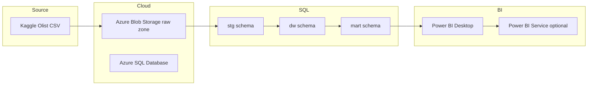
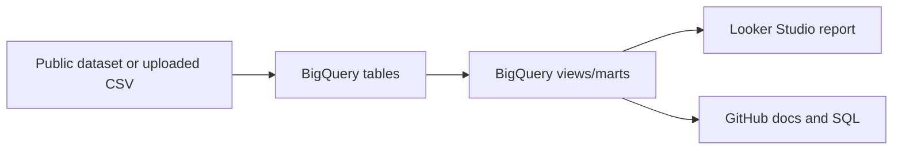

# Architecture

## Recommended Architecture: Azure + SQL Server + Power BI

## Why This Architecture

- **Azure Blob Storage** keeps raw files separate from transformed SQL data
- **Azure SQL Database** is close to MSSQL skills and fits analyst-facing SQL workloads
- **Power BI** connects naturally to SQL Server/Azure SQL and is common in analyst workflows
- **GitHub** stores code, SQL, docs and screenshots, not raw data or secrets

## Optional Architecture: BigQuery + Looker Studio

Use this track if the portfolio should show Google Cloud. BigQuery public datasets reduce setup effort because the public data is already hosted in BigQuery.

## Security and GitHub Rules

- Do not commit raw CSV, Parquet, PBIX cache exports or credentials
- Keep `.env` and cloud keys outside Git
- Commit only SQL scripts, documentation, screenshots and sample metadata
- Add cost notes if using cloud resources

